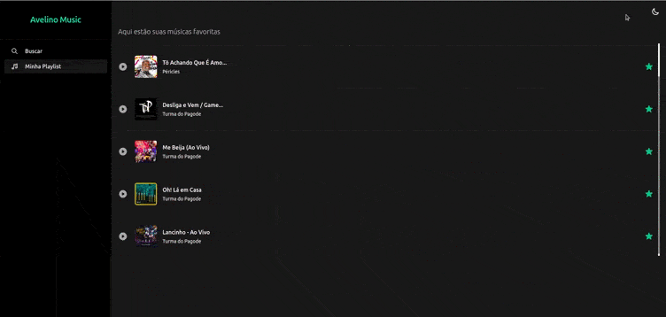

# **Avelino Music**
### Conecte-se com sua conta do Spotify e monte sua melhor Playlist

<hr/>

## **O que podemos encontrar por aqui?**
- [x] Padronização do código:
  - [x] ESlint
  - [x] Prettier
  - [x] Commit customizado
- [x] Para consumir serviços de terceiros:
  - [x] Axios (Consumindo serviço do Spotify)
- [x] No desenvolvimento:
  - [x] Typescript
  - [x] ES Next
  - [x] React
    - [x] Router - Suspense/Lazy
    - [x] Hooks
    - [x] Context API
    - [x] Reducer
    - [x] Client (Consumindo serviço do Spotify)
  - [x] Tailwind CSS
- [x] Para melhorar a experiência do usuário: 
  - [x] Theme Dark/Light
  - [x] Drag and Drop (Permitindo alterar o posicionamento dos itens da lista de resultados)
  - [x] Layout responsivo
  - [x] Notificação (Ao favoritar uma música)
  - [x] Reprodução de aúdio (Ao selecionar uma música)
  - [x] Armazenamento de informações no Local Storage (Manter a playlist do usuário atualizada)

<br/>

## Telas

### **Tela inicial (Sem autenticar)**
Ao clicar no botão, será feito um redirecionamento para que o usuário entre com a sua conta do Spotify


****
### **Tela inicial (Buscando música/album,etc...)**


***
### **Tela inicial (Visualizar o TOP 10 de um artista)**


***
### **Playlist (Visualizar a  playlist)**


### **Alterando posição dos itens da Playlist (Drag and Drop)**


***
### **Alterando tema (Dark/Light)**



## **Para rodar na sua máquina**

### Passos
  1. Fazer login no Spotify for Developers https://developer.spotify.com/dashboard/login
  2. Criar um novo APP
  3. Clicar em "Editar configurações"
  4. Adicionar em "Redirect URIs" o endereço de *callback* para sucesso ou erro ao tentar autenticar. Coloque como exemplo: `http://localhost:3000`
  5. Fazer um clone deste repositório
  6. Executar `npm install` ou `yarn install`
  7. Crie uma cópia do arquivo `.env.sample` e nomeia como `.env`
  8. Copie o `Client ID` e o `Client Secret` localizados no item 3
  9. Preencha os campos em `.env`
  ```
  // Preencha com Client ID conforme Item 8
  REACT_APP_CLIENT_ID = <Client ID>

  // Preencha com Client Secret conforme Item 9
  REACT_APP_CLIENT_SECRET = <Client Secret>

  // Preencha com endereço de callback adicionado conforme Item 4
  REACT_APP_REDIRECT_URL = http://localhost:3000

  // Nesta aplicação, o necessário como escopo é este Para mais informações acesse a documentação do Spotify
  REACT_APP_SCOPES = user-read-private

  // Nome da Key armazenada no Local Storage para manter o Token, tempo de expiração e Token para Refresh
  REACT_APP_AUTH_STORAGE = @app/spotifyAuth
  ```
  10. Execute `npm start` ou `yarn start`
  11. Acesse [http://localhost:3000](http://localhost:3000)

  ### Mais informações:
  * [Documentação Spotify](https://developer.spotify.com/documentation/web-api/guides/)