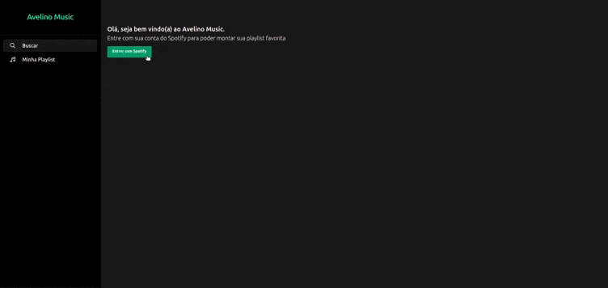
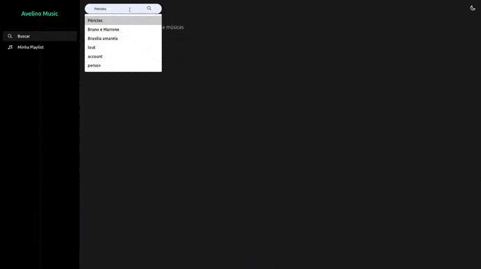
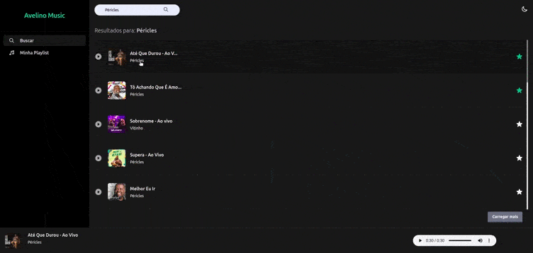
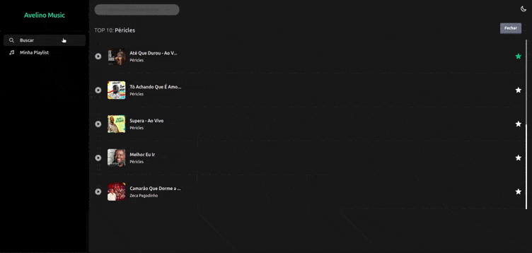
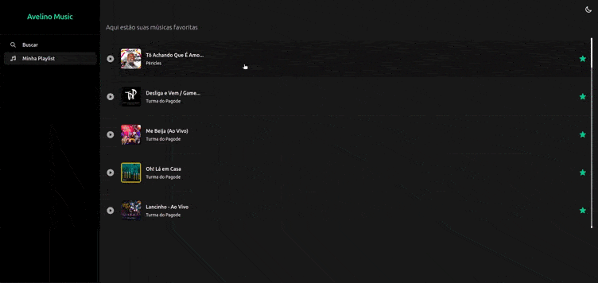

****
# **Avelino Music**
### Conecte-se com sua conta do Spotify e monte sua melhor Playlist

## **O que podemos encontrar por aqui?**
- [x] Padronização do código:
  - [x] ESlint
  - [x] Prettier
  - [x] Commit customizado
- [x] Para consumir serviços de terceiros:
  - [x] Axios (Consumindo serviço do Spotify)
- [x] No desenvolvimento:
  - [x] Typescript
  - [x] ES Next
  - [x] React
    - [x] Router - Suspense/Lazy
    - [x] Hooks
    - [x] Context API
    - [x] Reducer
    - [x] Client (Consumindo serviço do Spotify)
  - [x] Tailwind CSS
- [x] Para melhorar a experiência do usuário: 
  - [x] Theme Dark/Light
  - [x] Drag and Drop (Permitindo alterar o posicionamento dos itens da lista de resultados)
  - [x] Layout responsivo
  - [x] Notificação (Ao favoritar uma música)
  - [x] Reprodução de aúdio (Ao selecionar uma música)
  - [x] Armazenamento de informações no Local Storage (Manter a playlist do usuário atualizada)

 

# Telas

### **Tela inicial (Sem autenticar)**

****
### **Tela inicial (Buscando música/album,etc...)**

***
### **Tela inicial (Visualizar o TOP 10 de um artista)**

***
### **Playlist (Visualizar a  playlist)**

### **Alterando posição dos itens da Playlist (Dark/Light)**

***
### **Alterando tema (Dark/Light)**

